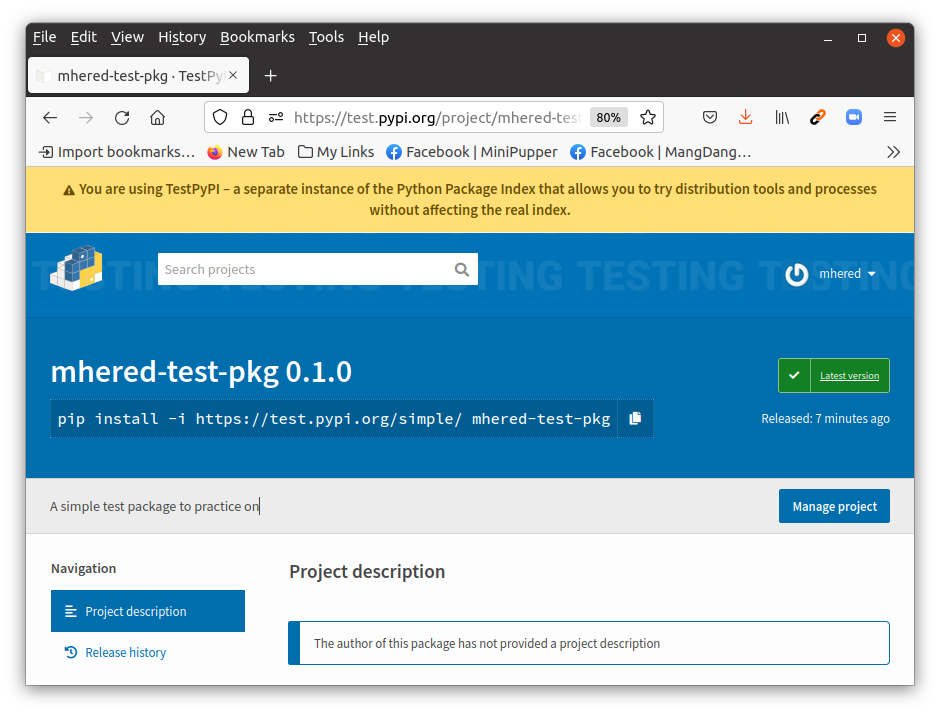

# mhered-test-pkg

`mhered-test-pkg` is a simple package to demonstrate how to create a python package. 

Inspired in this article: https://mathspp.com/blog/how-to-create-a-python-package-in-2022

## How to

### Pick a name

Check the name is available in [PiPy](https://pypi.org/)

### Initialize `poetry`

Install poetry (modified the instructions starting from [here](https://python-poetry.org/docs/#osx--linux--bashonwindows-install-instructions)):

 ```bash
$ curl -sSL https://install.python-poetry.org/ | python3 -
 ```

Create a dedicated folder locally and initialize poetry inside

```bash
$ cd ~
$ mkdir mhered-test-pkg
$ cd mhered-test-pkg

$ poetry new .
Created package mhered_test_pkg in .

$ tree
.
├── mhered_test_pkg
│   └── __init__.py
├── pyproject.toml
├── README.rst
└── tests
    ├── __init__.py
    └── test_mhered_test_pkg.py
    
$ mv README.rst README.md
$ poetry install
```

Note: I renamed README.rst to README.md because I prefer to work in Markdown.

Running `poetry install` creates a file `poetry.lock` with the dependencies

### Initialize git in the local folder

Create an empty github repo: **[mhered-test-pkg](https://github.com/mhered/mhered-test-pkg)** and follow the instructions to set it as the remote and push a first commit with the file structure:

```bash
$ git init
$ git add *
$ git commit -m "First commit"
$ git branch -M main
$ git remote add origin https://github.com/mhered/mhered-test-pkg.git
$ git push -u origin main
```

### Set up `pre-commit` hooks

  Add `pre-commit` as a development dependency, then commit updates:

```bash
$ poetry add -D pre-commit

$ git add poetry.lock pyproject.toml
$ git commit -m "Add pre-commit devt dependency."
```

Create a file `.pre-commit-config.yaml` in the root:

```yaml
# See https://pre-commit.com for more information
# See https://pre-commit.com/hooks.html for more hooks
repos:
  - repo: https://github.com/pre-commit/pre-commit-hooks
    rev: v4.0.1
    hooks:
      - id: check-toml
      - id: check-yaml
      - id: end-of-file-fixer
      - id: mixed-line-ending
  - repo: https://github.com/psf/black
    rev: 22.3.0
    hooks:
      - id: black
  - repo: https://github.com/PyCQA/isort
    rev: 5.10.1
    hooks:
      - id: isort
        args: ["--profile", "black"]
```

Activate the `poetry` virtual environment to be able to use `pre-commit` then install the hooks and then we run them once, just for good measure. 

```bash
$ poetry shell

$ pre-commit install
$ pre-commit run all-files
```

Note: `pre-commit` is not found if run from outside of the shell - you can use instead `poetry run pre-commit`

Commit the changes (including the updates to `README.md`):  

```bash
$ git add *
$ git commit -m "Run all pre-commits."
$ git push
```

Note: behavior is a bit strange. if some test fails, you need to add modified files and repeat the git commit - which is fine - but then if the file was open it seems to revert to an older version?

### Add a license

[Add a license from github](https://docs.github.com/en/communities/setting-up-your-project-for-healthy-contributions/adding-a-license-to-a-repository) then pull changes to local. 

This will add [LICENSE.md](./LICENSE.md)

### Upload the stub package to TestPyPI

Declare the test repository https://test.pypi.org in Poetry and name it  `testpypi`:

```bash
$ poetry config repositories.testpypi https://test.pypi.org/legacy/
```

[Create an account on TestPyPI](https://test.pypi.org/account/register/), go to Account Settings to get an API token and then configure Poetry to use it:

```bash
$ poetry config http-basic.testpypi __token__ pypi-YOUR-TESTPYPI-API-TOKEN
```

Note: Be careful not to expose your API token, e.g. if you write it to a file use .gitignore so as not to commit and publish it publicly!

Build and upload the package:

```bash
$ poetry build
$ poetry publish -r testpypi
```

With this our package is live in TestPyPI: https://test.pypi.org/project/mhered-test-pkg/



Note: Build creates the `dist` folder that should be added to `.gitignore`

```bash
$ echo dist/ >> .gitignore

$ git add .
$ git commit -m "Publish to TestPyPI"
$ git push
```

### Populate the package with code

For this example I wrote a simple Rock, Paper, Scissors game inspired and slightly refactored from the example proposed by Al Sweigart in his great book [Automate the boring stuff with Python](https://automatetheboringstuff.com/). The code goes in `mhered-test-pkg/__init__.py`.

### Changelog management

Add [scriv](https://pypi.org/project/scriv/) for changelog management, as a development dependency with the [toml] extra :

```
$ poetry add -D scriv[toml]
```

Configure scriv to use Markdown by adding the following lines to the `pyproject.toml` file, cfr [scriv's readthedocs](https://scriv.readthedocs.io/en/latest/configuration.html):

```toml
[tool.scriv]
format = "md"
```

Then create the default directory for changelog fragments `changelog.d`:

```
$ mkdir changelog.d
$ touch changelog.d/.gitkeep

$ scriv create

$ git add pyproject.toml poetry.lock changelog.d/.gitkeep
$ git commit -m "Add scriv as devt dependency."
```

Note: `.gitkeep`  so that git tracks the empty folder

A `md` file is created in the `changelog.d` folder. Add a description:

```markdown
### Added

- A first simple implementation of Rock Paper Scissors

```

Lets update README.md and commit everything:

```bash

$ git add README.md changelog.d/* __init__.py
$ git commit -m "Simple Rock Paper Scissors game"
```

### Publish the package to PyPI

Create a [PyPI](https://pypi.org/) account and API token, and configure Poetry to use it:

```bash
$ poetry config pypi-token.pipy pypi-YOUR-PYPI-API-TOKEN
```

Build and publish:

```bash
$ poetry publish --build
```

### Do a victory lap

Install, import and uninstall the package (outside of the shell) to check it works

```bash
$ python3 -m pip install mhered-test-pkg
Defaulting to user installation because normal site-packages is not writeable
Collecting mhered-test-pkg
  Using cached mhered_test_pkg-0.1.0-py3-none-any.whl (2.5 kB)
Installing collected packages: mhered-test-pkg
Successfully installed mhered-test-pkg-0.1.0

$ python3
Python 3.8.10 (default, Jun 22 2022, 20:18:18) 
[GCC 9.4.0] on linux
Type "help", "copyright", "credits" or "license" for more information.
>>> import mhered_test_pkg
ROCK, PAPER, SCISSORS
0 Wins, 0 Losses, 0 Ties
Enter your move: (r)ock (p)aper (s)cissors or (q)uit
r
ROCK versus... SCISSORS
You win!
1 Wins, 0 Losses, 0 Ties
Enter your move: (r)ock (p)aper (s)cissors or (q)uit
q
Bye!

$ python3 -m pip uninstall mhered-test-pkg
ROCK, PAPER, SCISSORS
0 Wins, 0 Losses, 0 Ties
Enter your move: (r)ock (p)aper (s)cissors or (q)uit
r
ROCK versus... SCISSORS
You win!
1 Wins, 0 Losses, 0 Ties
Enter your move: (r)ock (p)aper (s)cissors or (q)uit
q
Bye!
```

Ready to publish a release...
